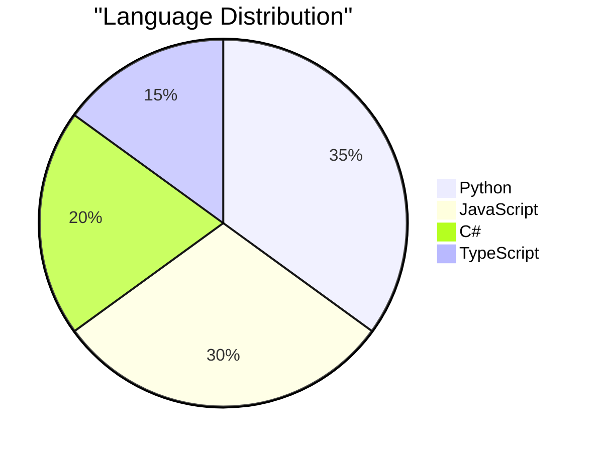

# Hi 👋, I'm Jordy Pincay
<h3 align="center">A passionate Software Engineering student from Ecuador 🇪🇨</h3>

## 🎓 Academic Background
Currently pursuing a degree in Software Engineering at **Universidad Estatal de Milagro (UNEMI)**, where I'm developing a strong foundation in software development principles and practices.

## 💻 Technical Skills

### Programming Languages
- Python
- JavaScript
- C#
- C++
- TypeScript

### Frameworks & Tools
- **Frontend**: React.js, Tailwind CSS
- **Backend**: Django, Flask, Node.js
- **Cloud Services**: Amazon Web Services (AWS)
- **Databases**: PostgreSQL

## 📊 GitHub Statistics

### Most Used Languages


### Contribution Graph

```mermaid
%%{init: {
  'theme': 'dark',
  'themeVariables': {
    'primaryColor': '#051632',
    'secondaryColor': '#3268a8'
  }
}}%%
gantt
    title GitHub Contributions
    dateFormat  X
    axisFormat %d
    section 2024
    Contributions     :a1, 0, 30
    More Activity     :a2, 5, 25
    Peak Period      :a3, 10, 20
    Active Phase     :a4, 15, 30
```


## 🌐 Connect With Me
<p align="left">
<a href="https://www.linkedin.com/in/jordy-david-pincay-murillo-9029502b8/" target="blank"></a>
</p>

## 📫 How to Reach Me
- Academic Email: jpincaym7@unemi.edu.ec

## 💡 About Me
```javascript
const aboutMe = {
  currentlyWorking: "On innovative software projects",
  learning: ["Cloud Architecture", "DevOps", "System Design"],
  interests: ["Web Development", "Cloud Computing", "Software Architecture"],
  technologies: {
    backEnd: ["Python", "Node.js", "C#"],
    frontEnd: ["React", "JavaScript", "TypeScript"],
    cloud: ["AWS"],
    databases: ["PostgreSQL"],
  }
};
```

---
⭐️ From [jpincaym7]
